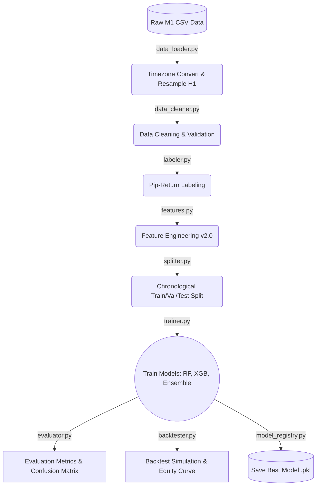

# 📈 Forex Machine Learning Trading 


An **end-to-end Machine Learning pipeline** built specifically for Forex Trading (EUR/USD). This pipeline takes raw M1 tick data, engineers highly advanced financial features (without look-ahead bias), trains an ensemble of robust ML models, and rigorously backtests the strategy using real-world constraints (spread, slippage).

---

## 🚀 Features

- **Strict Anti-Leakage Design**: The #1 cause of failed trading models is data leakage. Every price-based feature here is strictly shifted by 1 period.
- **Advanced Feature Engineering**: Extrapolates ~45 sophisticated features including Momentum (Williams %R, CCI, ADX), Volatility Regimes, Price Action Microstructures, and Lag Returns.
- **Ensemble Modeling**: Employs Soft-Voting across fine-tuned Random Forest and XGBoost classifiers.
- **Realistic Backtesting Engine**: Incorporates Spread (2 pips), Slippage (0.5 pips), dynamic SL/TP (20/40), and Daily Drawdown limits.
- **Production Ready Skeleton**: Includes a `signal_engine.py` mimicking a live ticker stream for easy transition into OANDA / MetaTrader 5 API integration.

---

## 🏗️ Architecture



---

## 📁 Repository Structure

```text
📦 Forex_Machine_Learning
 ┣ 📂 data/               # Drop your histdata.com CSVs here (ignored by git)
 ┣ 📂 models/             # Trained .pkl models are saved here (ignored by git)
 ┣ 📂 outputs/            # Charts, equity curves, metrics (ignored by git)
 ┣ 📂 logs/               # Live prediction logs (ignored by git)
 ┣ 📜 config.py           # Centralized brain: All hyperparameters & SL/TP
 ┣ 📜 data_loader.py      # Multi-CSV loader & H1 resampler
 ┣ 📜 features.py         # 45+ Technical Indicators & Price action logic
 ┣ 📜 trainer.py          # Random Forest, XGBoost & Voting Classifier
 ┣ 📜 evaluator.py        # Model scoring & Chart generation
 ┣ 📜 backtester.py       # Trading simulation & Profit calculation
 ┣ 📜 signal_engine.py    # Production-ready live signal generator
 ┗ 📜 run_pipeline.py     # Main orchestrator (Run this!)
```

---

## ⚙️ How to Run Locally / Google Colab

1. **Clone the repository:**
   ```bash
   git clone https://github.com/Daapputra/Forex_Machine_Learning.git
   cd Forex_Machine_Learning
   ```

2. **Install Dependencies:**
   ```bash
   pip install pandas pandas-ta scikit-learn xgboost joblib matplotlib pyyaml
   ```

3. **Provide Data:**
   - Download `EUR/USD M1 ASCII` data from [histdata.com](https://www.histdata.com/).
   - Extract the `.csv` files into the `data/` folder. The system will automatically combine and chronologically sort multiple years of data!

4. **Run the Pipeline:**
   ```bash
   python run_pipeline.py
   ```

5. **View Results:**
   Check the `outputs/` folder for your Backtest Equity Curve, Confusion Matrices, and Feature Importance charts!

---

## 🔮 Roadmap / Next Steps

- [x] Build and validate modular local pipeline.
- [x] Ingest and train on 5-years of H1 historical data.
- [ ] Transition from paper trading to live trading APIs (e.g. OANDA / MetaTrader 5).
- [ ] Integrate deep learning (LSTMs) for sequence pattern recognition.

---
*Disclaimer: This repository is for educational and research purposes only. Do not trade with real money unless you fully understand the risks of the Forex market.*
